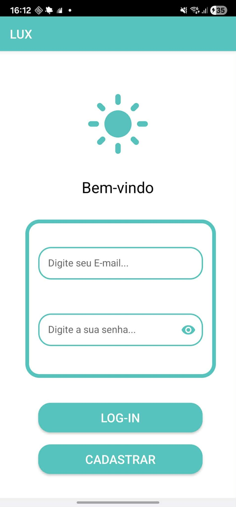
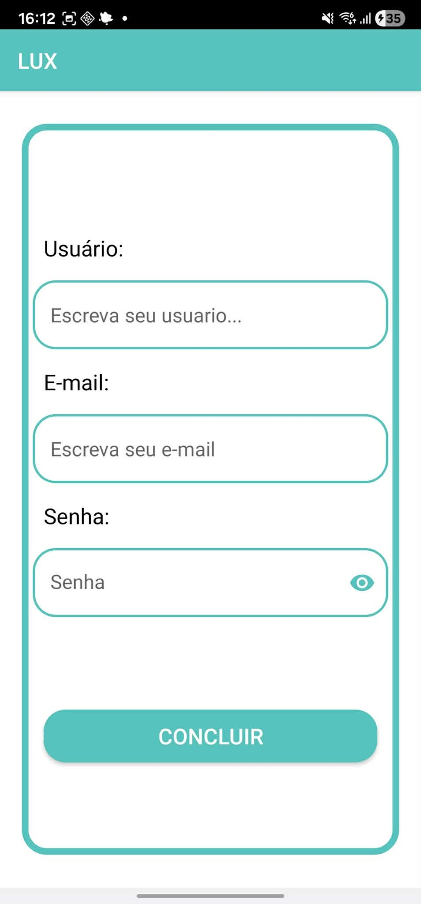
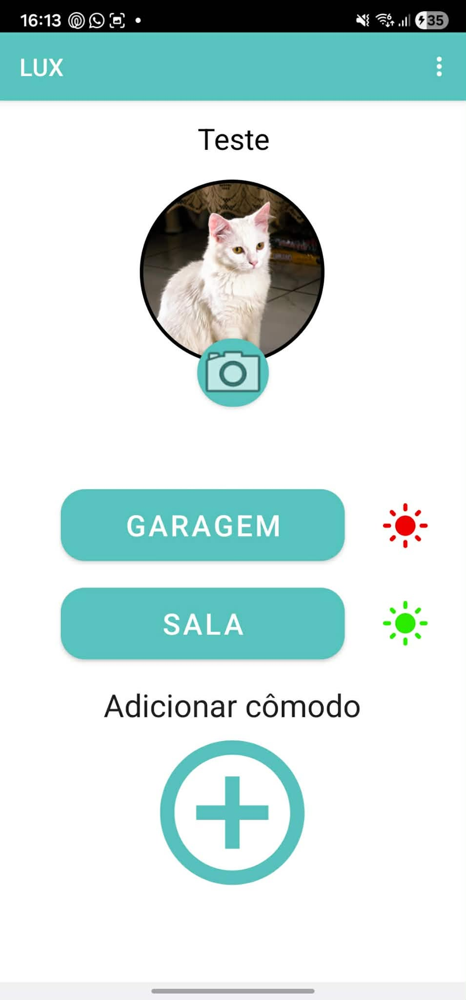
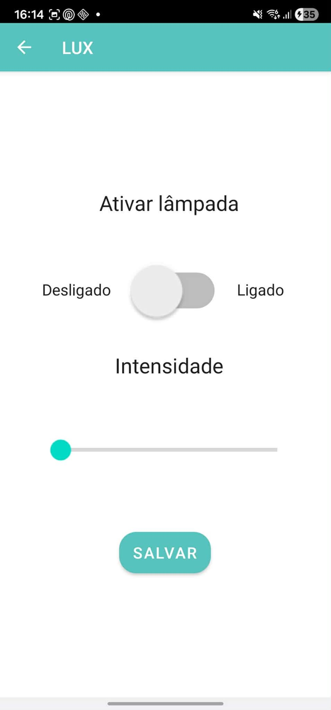
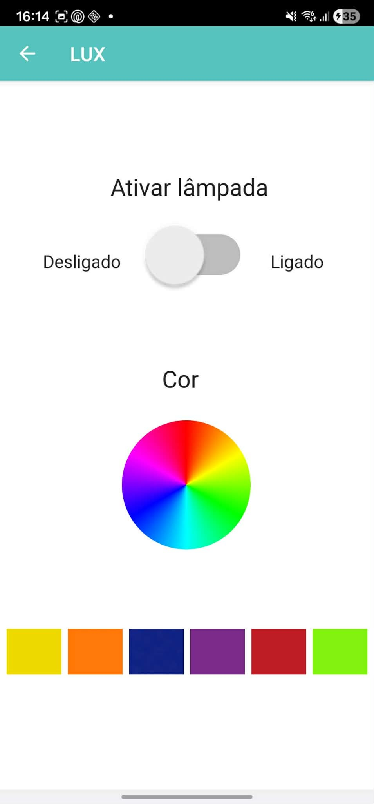

# 💡 LUX — Controle de Lâmpadas via Bluetooth

O **LUX** é um aplicativo mobile desenvolvido em **2023**, com o objetivo de permitir o **controle remoto de lâmpadas através do celular**, utilizando **Bluetooth** e **Arduino** para uma automação residencial simples.

Este projeto foi criado como um experimento de automação doméstica, integrando **hardware e software**, permitindo controlar diferentes lâmpadas diretamente pelo smartphone.

---

# 📱 Screenshots

  
  
  

  
  

---

# 🚀 Funcionalidades

- 🔐 Cadastro de usuário
- 🔑 Login com autenticação
- 🏠 Gerenciamento de cômodos
- 💡 Controle de lâmpadas via Bluetooth
- 🎚 Controle de intensidade da luz
- 🌈 Alteração de cores RGB (para lâmpadas compatíveis)
- 💾 Salvamento das configurações no Firebase
- ➕ Adição de novos cômodos
- 📷 Alteração de imagem do cômodo

---

# 🧠 Ideia do Projeto

A proposta do aplicativo era permitir a **automação básica de iluminação residencial**, utilizando:

- **Arduino com módulo Bluetooth**
- Lâmpadas com suporte a **Bluetooth**
- Controle via **aplicativo mobile**

O circuito do Arduino e o código embarcado foram desenvolvidos manualmente, permitindo:

- Ligar e desligar lâmpadas
- Alterar intensidade
- Alterar cor RGB
- Salvar configurações no Firebase

---

# 🛠 Tecnologias Utilizadas

- **Java (Android)**
- **Firebase**
- **Bluetooth**
- **Arduino**
- **XML (Interface Android)**

---

# 🔌 Integração com Hardware

Para funcionamento completo do sistema, era necessário:

- Um **Arduino**
- Um **módulo Bluetooth**
- Lâmpadas conectadas ao circuito
- Ou lâmpadas com **Bluetooth integrado**

O Arduino era responsável por:

- Receber comandos do aplicativo
- Controlar o estado das lâmpadas
- Ajustar intensidade e cor

---

# 🔮 Melhorias Planejadas

Algumas ideias futuras para o projeto incluíam:

- 🕒 Agendamento automático (ligar/desligar por horário)
- 🏠 Gerenciamento completo de múltiplos cômodos
- 📅 Programação semanal
- ☁️ Sincronização avançada com Firebase
- 📡 Suporte a Wi-Fi além de Bluetooth

---

# ⚠️ Observações

O protótipo físico do Arduino foi desenvolvido durante o projeto, porém não foi salvo posteriormente.

Mesmo assim, o aplicativo representa a lógica completa de comunicação e controle de iluminação.

---

# 👨‍💻 Autor

**Alexandre de Melo**  
Projeto desenvolvido em **2023** como estudo de automação residencial e integração entre hardware e software.

---

# 📄 Licença

Este projeto é destinado para fins educacionais e experimentais.